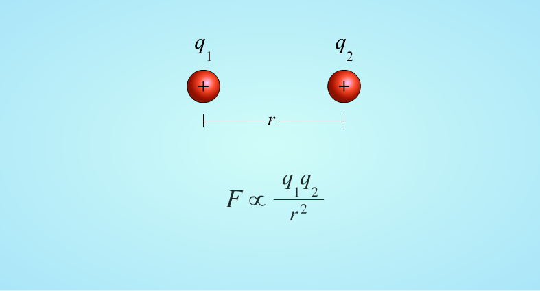
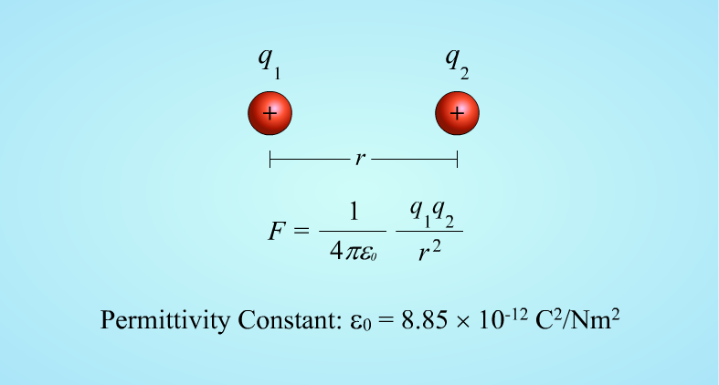
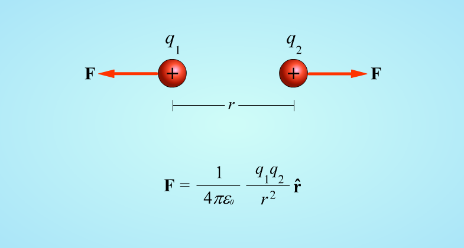
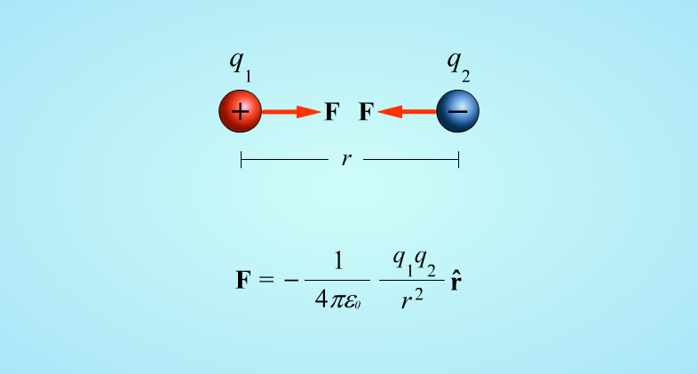
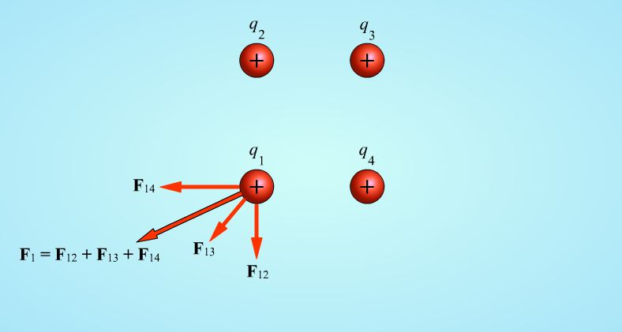

We have learned previously (I hope) that an inherent property about an object, is its mass (meaning that an object with a smaller mass has smaller inertia compared to one with larger mass).
In the same way, an inherent property of objects is its electrical charge.
This concept of electrical charge is not new. Its roots begin with Thales of Miletus in 600 B.C. with a simple experiment.

</img>

The experiment consists of rubbing a plastic pipe with fur (although the materials can be different) and then approach it to a suspended object and see it move away.
BUT 🍑 if we were to use a glass rod and rubbed it with silk, the opposite effect would happen, making the glass rod attract the suspended object (in this case made of plastic).

### Charges

So, what does this mean? It means that there are different types of electrical charges:

➕ Positive 
➖ Negative

And that these charges interact in different ways with each other, by attracting their opposite (yes, this is where the phrase comes from) and repelling one another.
Benjamin Franklin was the one who named these two types of charges negative and positive.  
> The basic unit of charge in the MKS system (Meter, Kilogram & Second) is the __Coulomb__ [ __C__ ].

### Particles

On an atomic level, particles carry charge, and there are three types of particles for that matter:

➕ Protons (Positively Charged)  
⭕ Neutrons (No Charge)  
➖ Electrons (Negatively Charged)

Protons and Electrons carry the same charge (denoted by __q__). The basic unit of charge is:

__1.60 x 10^-19 C__

So that would make our particles have their respective charges:

➕ Protons: __q = 1.60 x 10^-19 C__  
⭕ Neutrons: __q = 0__  
➖ Electrons: __q = -1.60 x 10^-19 C__

Even though Protons and Electrnos carry an equal but opposite charge, their masses are very different:

➕ Protons: __m = 1.67 x 10^-27 kg__  
⭕ Neutrons: __m = 1.67 x 10^-27 kg__  
➖ Electrons: __m = 9.11 x 10^-31 kg__

> These are very small numbers, and understanding their size can be difficult, but just keep in mind that Protons are almost 2000 times heavier than Electrons.

### Atoms

Atoms are made up of a nucleus of positively charged protons surrounded by negatively charged electrons.

</img>

On average, most objects have an equal number of positive and negative charges, making them charge-neutral. So, when all of the charges in an object are added, __the sum is zero__.

In the experiment with the glass rod and the silk cloth, we ended up transfering charges, leaving the rod with a net positive charge, and the silk with a net negative charge.

> Its important to note, that this was only a rearrangement of charges (nothing was created or destroyed).    __Conservation of Charge__: *Total charge is always conserved, and cannot be created or destroyed.*   This is analogous to the statement of energy conservation.

### Materials

The materials of objects usually fall into two classes: 

🦾 Conductors: 
- Negative electrical charges flow freely
- (Metals like copper, the human body, etc.)

💪🏻 Insulators: 
- Charges don't flow easily and can build up on its surface
- (Glass, plastic, etc.)

That's the reason touching a current-carrying wire with your bare hands is a bad idea, because both you and the wire are conductors. This means that charge could freely flow through your whole body (not exactly the best feeling). 
If you used an insulator (like a plastic glove), you wouldn't get shocked, because now the flow wouldn't be able to flow through the plastic to your body.

### Coulomb's Law

Charles Coulomb carried out a series of experiments in the 1700's to measure electrical attractions. From these experiments, he deduced the law that governs electrical attractions.

Imagine we have two positive charges, __q1__ and __q2__, separated by a distance __r__. 
The electrical force of one charge on the other, is:
- Proportional to the product of the two charges 
- Inversely proportional to the square of the distance between them.

The proportionality constant, is 1/4π∑0.  
The factor ∑0 is known as the *__permittivity constant__* and has a value of 8.85 x 10¯¹² [ C²/Nm² ]

The expression for the electrical force is known as __Coulomb's Law__, and like any force in the MKS system, it has __Newtons__ as it's unit. 
And like all forces, __its a vector__, and it points in the radial direction either towards or away from a spherical charge.

For two positive charges, the force of one charge on the other is in the direction away from the charge. If released, the charges would move away from each other.

If one charge is positive, and the other negative, the force of the negative charge is towards the positive charge.

If more than two charges are present, the total force acting on one of the charges, is the sum of the forces exerted on that one particle by the other particles.

