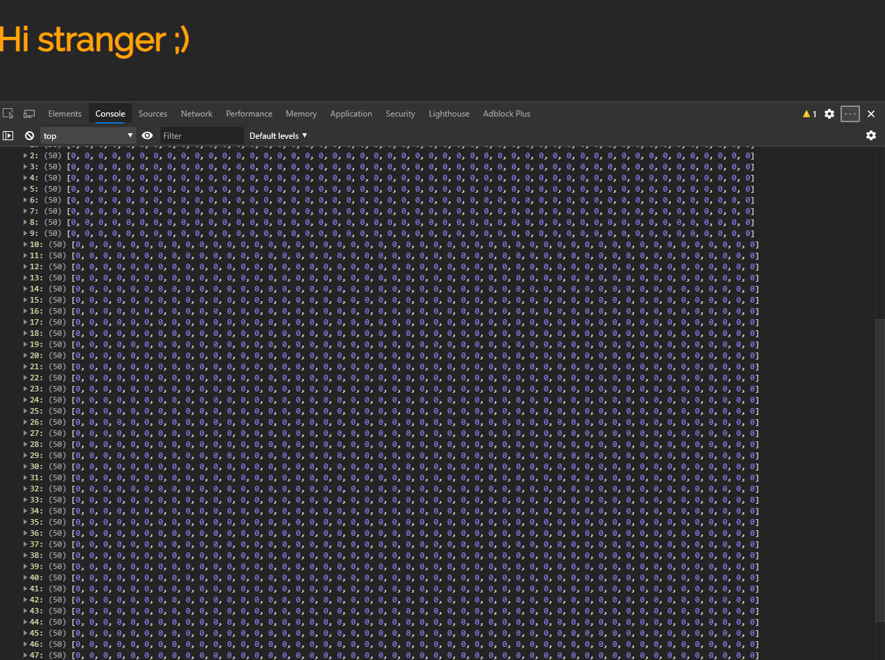
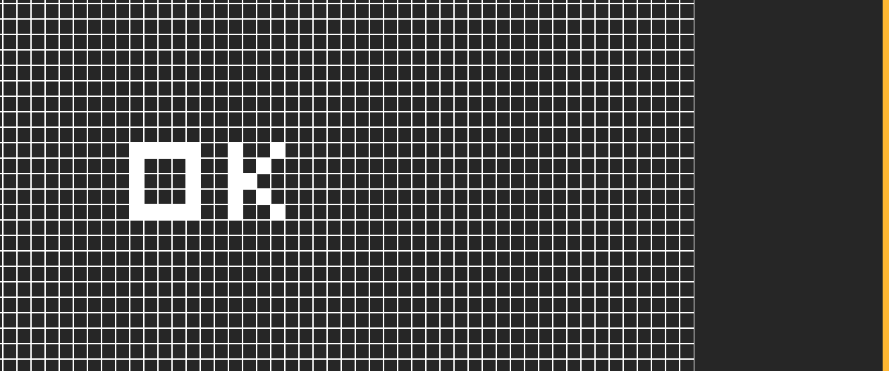

### The Game

Conway's Game of Life is a life simulator where there is a grid and each box represents a cell, and based on its neighbors, the cells will reproduce or die, and in the process, we get to see the cells forming patterns as they live and die.

[More Information Here](https://en.wikipedia.org/wiki/Conway%27s_Game_of_Life)

But as we can see, this game is simple and has a great teaching potential, which is why I was very interested in writing this post and learning along the way (since before this I was oblivious as to how React Hooks worked).

This post is basically a Blog version of [Ben Awad's video](https://youtu.be/DvVt11mPuM0) about Conway's Game. I decided to do this post to learn more about React, document my knowledge and maybe even help others learn, but all the credit goes to Ben, so check out his video too as he is a preacher of the React Religion ⚛🙌🏻⚛

> Check out the final product [here](../conwaysgameoflife)

### Setup
We begin by creating our React app by using the following command. We could also set the flag __--typescript__ to use TS while developing our game, but for now we will be using good ol' Javascript.
```console
npx create-react-app conwaysgame
```
Now we import __React__ and __useState__ to be able to use Hooks and we create a small usable component just so we can test that everything is working correctly.
```jsx
import React, { useState } from 'react'

const ConwaysGame = () => {
    return <h1>Hi stranger ;)</h1>
}

export default ConwaysGame
```
If everything looks fine and there are no errors, we can move on to the fun stuff.

### Creating The Grid
Almost always, when coding a game, we begin by developing the board, grid, field or whatever the main game is going to be on.
We add to our existing code this line:
```jsx
const [] = useState();
```
This is our empty hook, it uses the useState function which allows us to give our functional component a local state.
```jsx
const [grid, setGrid] = useState();
```
When using hooks, we must set a variable for the current state of the value we want to declare, and a function name to update that state.

> useState() returns a pair: the current state value and a function that lets you update it. We can call the function from an event handler or somewhere else, its just like __this.setState__ in a class, except it doesn't merge the old and new state together. <br> Check out the official [React Hooks Documentation](https://reactjs.org/docs/hooks-overview.html#state-hook) here.

Inside the useState(*__here__*) function, we declare the initial state of that variable. For our game, we will use a function that creates/fills the grid, so that way, it runs only once when the state is initialized.
```jsx
const ConwaysGame = () => {
    const [grid, setGrid] = useState(()=>{
        // Create Grid
    });

    return <h1>Hi stranger ;)</h1>
}
```
We set an empty array that will represent the rows, in which we will insert the columns.
```jsx
const ConwaysGame = () => {
    const [grid, setGrid] = useState(()=>{
        const rows = [];     
    });

    return <h1>Hi stranger ;)</h1>
}
```
Before we continue, we should declare constant global variables to define the size of our grid. We will do just that, outside of our component.
```jsx
const numRows = 50;
const numCols = 50;
```
Now we create a loop so we can insert columns on each row. The way we will create the columns is with the __Array.from()__ method which will be explained later.
```jsx
for(let i = 0; i < numRows; i++) {
    rows.push(Array.from(Array(numCols), () => 0));
}
```
The way this works is that, for each row, a new array is created and pushed into it, and this array is created with the __Array.from()__ method, which takes three parameters (*__object__*, *__mapFunction__*, *__thisValue__*), but we will only use the first two.

We need to pass in an iterable object, in this case we do it by creating an array as big as the number of columns we declared earlier.

Then within the map function, we only pass in a value of 0, this is because we will make the game in a way that 0 means dead, and 1 means alive, so logically we want our grid to begin as a blank slate.

Lets not forget to return our grid, and so far our component should look like this:
```jsx
const numRows = 50;
const numCols = 50;

const ConwaysGame = () => {
    const [grid, setGrid] = useState(()=>{
        const rows = [];  
        for(let i = 0; i < numRows; i++) {
            rows.push(Array.from(Array(numCols), () => 0));
        }       

        return rows;
    });

    return <h1>Hi stranger ;)</h1>
}
```
If you want, you could add a __console.log(grid)__ right before the \<h1\> is returned so you can visualize how the grid ends up.
You should see something like this:


### Displaying The Grid

Now we need to actually show the grid, and we could start by removing our test \<h1\> and our console.log() if we added one.

Since React can only return one component with a closing tag, we will wrap everything inside a single div.

```jsx
return (
    <div>

    </div>
)
```
And inside these tags, we will open some curly brackets so we can code in JS. 

We are going to map the rows to our grid, map our columns to our rows, and map a div to our columns, which will represent the individual cells of our grid.

```jsx
return (
    <div>
        {grid.map(
            rows => rows.map(
                col => 
                    <div />))}
    </div>
)
```
Until now we cant actually see these cells, so we need to add some style to them. We could create a separte style sheet, but for now we will just add the styles inline.
We will also add a key so we can identify if the cell is dead or alive, and show a different color accordingly.
```jsx
return (
    <div>
        {grid.map(
            (rows, i) => rows.map(
                (col, j) => 
                    <div
                    key={`${i}-${j}`} 
                        style={{
                        width: 20,
                        height: 20,
                        backgroundColor: grid[i][j] ? 'white' : undefined,
                        border: 'solid 1px white'
                        }} 
                    />
                ))}
    </div>
)
```
> Usually we wouldn't want to use the index as a key, but in this case the divs themselves will not shift, so no biggie.

At this point we will only see a huge column of boxes, so to fix that we could put them into a CSS grid. 

The main div will become a display of type grid, and we need to tell it how many columns we want by adding this.

```jsx
<div style={{
    display:'grid',
    gridTemplateColumns: `repeat(${numCols}, 20px)`
}}>
{grid.map(
    (rows, i) => rows.map(
        (col, j) => 
            <div
            key={`${i}-${j}`} 
                style={{
                width: 20,
                height: 20,
                backgroundColor: grid[i][j] ? 'white' : undefined,
                border: 'solid 1px white'
                }} 
            />
        ))}
</div>
```
> The arguments in gridTemplateColumns are to declare how many columns the grid will have and how big they will be. We go for 20px because thats the size of the width we gave each individual box. If you want to change the size of your boxes, now you need to change the columns in the main div, and the size of your individual boxes in the mapping function.

### Making Interactive Boxes

We are able to see our grid, great, but it doesn't do anything. 
In this section we will make the boxes clickable, turning a cell dead or alive depending on its state. 
By adding the __onClick__ attribute to our box's div, we give it functionality whenever we click it.

```jsx
<div
    key={`${i}-${j}`} 
    onClick={()=>{
        grid[i][j] = 1;
...
```
Doing it this way might be comfortable, but in React this is wrong, as we shouldn't change state this way, UNLESS we use a library that makes it correct. In this case we will use [__immer__](https://github.com/immerjs/immer). 

> Changing state by mutating it directly is bad, so always use setState or your hooks' set functions

First we need to stop our development server, so on our console we use the good ol' __CTRL + C__

```console
^C
Terminate batch job (Y/N)? Y
```

Install __immer__ to the project. Depending on your package manager the instructions might be different.

```console
yarn add immer
```

When the installation is finished we need to import produce to our component, as this is what will allow us to change state correctly by still using the last syntax.

```jsx
import produce from 'immer'
```

Now, going back to our clickable div, we will divide the state update in two parts:

```jsx
<div
    key={`${i}-${j}`} 
    onClick={()=>{
        const newGrid = produce(grid, gridCopy => {
            gridCopy[i][j] = 1;
        });
        setGrid(newGrid);
    }}
...
```
First we create a completely new grid where a modified value will live (the box we clicked). We do this by using the produce method we imported earlier which receives the current state, and the new state, but the cool thing is that for the new state we are allowed to use the bad but simple syntax.

Second, we now use the advised and correct syntax of our setGrid function BUT with the updated state we created in the first part, allowing React to correctly update the state.

Now we should be able to fill our boxes

But we are not quite there yet, since it would be much much better if we could make the boxes toggable.

To do that, all we have to do is instead of setting the value of the box to 1 on click, we make it conditional depending on its actual state:

```jsx
onClick={()=>{
    const newGrid = produce(grid, gridCopy => {
        gridCopy[i][j] = gridCopy[i][j] ? 0 : 1;
    });
    setGrid(newGrid);
}}
```
### Simulation

This is the point where we start cookin'. Now we will begin to add some logic and actual game mechanics. 

As a good starting point, we will add a button that starts the simulation of our game.

```jsx
return (
    <>
    <button>Start</button>

        <div style={{
            display:'grid',
            gridTemplateColumns: `repeat(${numCols}, 20px)`
        }}>
        {grid.map(
        ...
        </div>
    </>
)
```
> As you can see, we added __<>__ and __</>__ which represent a fragment in React. We use this so we can return a single value, while being able to have multiple children on the same level.

There are multiple ways to handle the state of our game, in other words if its running or not, but in this case we will store it as a constant state variable and initialize it as false.
```jsx
const [running, setRunning] = useState(false);
```

And change our button to conditionally change the state of __running__ as well as what the button displays.

```jsx
<button onClick={()=>{
    setRunning(!running);
    }}
>
    {running ? 'Stop' : 'Start'}
</button>
```

Now we will create a function that will handle how the game works, and we will call it runSimulation.

```jsx
const runSimulation = useCallback(() => {

}, []);
```

> useCallback() is imported with React, and this assures us that he function will not be recreated on every render. We must pass an empty array as a parameter for it to work.

We only want the function working if we click on start, so we add a conditional for it. 
Also, we add a Timeout to simulate a refresh rate. In this case we will set it to 1 second.

```jsx
const runSimulation = useCallback(() => {
    if(!running) {
        return;
    }

    // simulate
    setTimeout(runSimulation, 1000);

}, []);
```

The problem with this, being a semi-recursive type of deal, is that our function will not change, but the condition of running will. So, to be able to keep up, we must link them with a Ref hook. 

```jsx
const runningRef = useRef();
runningRef.current = running;
```

By including this Ref in our runningSimulation() there should be no errors and all should go smoothly.

### Game Rules

Now we have to code the rules of the game, which are:
```output
- Any live cell with fewer than two live neighbours dies, as if by underpopulation.
- Any live cell with two or three live neighbours lives on to the next generation.
- Any live cell with more than three live neighbours dies, as if by overpopulation.
- Any dead cell with exactly three live neighbours becomes a live cell, as if by reproduction.
```

First we will use a double loop to check each box's neighbours and determine if it should be dead or alive. Just as before, we will be using the __produce()__ method from __immer__ so we can easily and safely mutate the state.

We will do this by using the setGrid() function, and using the current state of the grid. This will allow us to implement the produce() method and return a mutable copy (this is where the double loop comes in).

```jsx
setGrid((grid) => {
    return produce(grid, gridCopy => {
        for(let i = 0; i < numRows; i++) {
            for(let j = 0; j < numCols; j++) {

            }
        }
    })
})
```

Now, to determine or count how many neighbours a cell has, we will use an operations array, to easily determine if does or doesn't have a neighbor without duplicating so much logic.

```jsx
const operations = [
    [0, 1],
    [1, 0],
    [0, -1],
    [-1, 0],
    [-1, -1],
    [1, -1],
    [-1, 1],
    [1, 1]
]
```
> We could count the neighbours with __if statements__, but that's kind of tacky ;)

So now, we can use a pretty elegant logic by comparing the operations array to the specific cell, just by how the values end up after comparing them.

Also, in the same counting, we can check if it's out of bounds.

```jsx
setGrid((grid) => {
    return produce(grid, gridCopy => {
        for(let i = 0; i < numRows; i++) {
            for(let j = 0; j < numCols; j++) {
                let neighbors = 0;
                operations.forEach(([x, y]) => {
                    const newI = i + x;
                    const newJ = j + y;
                    if (
                        newI >= 0 &&
                        newI < numRows &&
                        newJ >= 0 &&
                        newJ < numCols
                        ) {
                            
                        neighbors += grid[newI][newJ];
                    }
                })
            }
        }
    })
})
```

All we have to do now, is change the cell's current status depending on the resulting neighbor count, and we will do this by adding some if statements. First we will cover rules 1 and 3.

```jsx
if (neighbors < 2 || neighbors > 3) {
    gridCopy[i][j] = 0;
}
```

And since rule 2 is about preserving state (considering nothing actually happens) all we have to worry about now is rule 4. Which we'll do with:
```jsx
else if (grid[i][j] === 0 && neighbors === 3) { 
    gridCopy[i][j] = 1; 
    }
```

### Running The Simulation

We need to tweak a little bit our button, because maybe the simulation is programmed well, but nobody is actually calling it. So we just add our function on the onClick() of our button

```jsx
<button onClick={()=>{
    setRunning(!running);
        if (!running) {
        runningRef.current = true
        runSimulation()
        }
}}>
```
> We add the Ref as a way to be safe against state update times, since maybe when we click the button, the simulation may run before the new state of Running returns. 

### Finishing Touches

Just to make the game a bit better, we will add some extra bonuses.

For starters lets change the refresh rate so that it looks faster and cooler.

```jsx
setTimeout(runSimulation, 100)
```

We will also change the initialization of our grid to a function so that we can use it at the start of our component, AND within a reset button.

```jsx
const generateEmptyGrid = () => {
    const rows = [];
    for (let i = 0; i < numRows; i++) {
        rows.push(Array.from(Array(numCols), () => 0));
    }

    return rows;
}

const ConwaysGame = () => {
  const [grid, setGrid] = useState(() => {
        return generateEmptyGrid();
  })

...

<button
onClick={() => {
    setGrid(generateEmptyGrid());  
}}
>
Reset
</button>
```

And why not add a randomize button while we're at it.

```jsx
<button
onClick={() => {
    const rows = []
    for (let i = 0; i < numRows; i++) {
    rows.push(
        Array.from(Array(numCols), () => (Math.random() > 0.8 ? 1 : 0))
    )
    }

    setGrid(rows)
}}
>
Random
</button>
```

### Full Code

```jsx
import React, { useState, useCallback, useRef } from "react"
import Layout from '../components/layout'
import Head from '../components/head'
import produce from "immer"

const numCols = 30
const numRows = 30

const operations = [
  [0, 1],
  [1, 0],
  [0, -1],
  [-1, 0],
  [-1, -1],
  [1, -1],
  [-1, 1],
  [1, 1],
]

const generateEmptyGrid = () => {
  const rows = []
  for (let i = 0; i < numRows; i++) {
    rows.push(Array.from(Array(numCols), () => 0))
  }

  return rows
}

const ConwaysGame = () => {
  const [grid, setGrid] = useState(() => {
    return generateEmptyGrid()
  })

  const [running, setRunning] = useState(false)

  const runningRef = useRef()
  runningRef.current = running

  const runSimulation = useCallback(() => {
    if (!runningRef.current) {
      return
    }

    setGrid(g => {
      return produce(g, gridCopy => {
        for (let i = 0; i < numRows; i++) {
          for (let j = 0; j < numCols; j++) {
            let neighbors = 0
            operations.forEach(([x, y]) => {
              const newI = i + x
              const newJ = j + y
              if (newI >= 0 && newI < numRows && newJ >= 0 && newJ < numCols) {
                neighbors += g[newI][newJ]
              }
            })

            if (neighbors < 2 || neighbors > 3) {
              gridCopy[i][j] = 0
            } else if (g[i][j] === 0 && neighbors === 3) {
              gridCopy[i][j] = 1
            }
          }
        }
      })
    })

    setTimeout(runSimulation, 100)
  }, [])

  return (
    <>
      <button
        onClick={() => {
          setRunning(!running)
          if (!running) {
            runningRef.current = true
            runSimulation()
          }
        }}
      >
        {running ? "Stop" : "Start"}
      </button>
      <button
        onClick={() => {
          setGrid(generateEmptyGrid())
        }}
      >
        Reset
      </button>
      <button
        onClick={() => {
          const rows = []
          for (let i = 0; i < numRows; i++) {
            rows.push(
              Array.from(Array(numCols), () => (Math.random() > 0.8 ? 1 : 0))
            )
          }

          setGrid(rows)
        }}
      >
        Random
      </button>
      <div
        style={{
          display: "grid",
          gridTemplateColumns: `repeat(${numCols}, 20px)`,
        }}
      >
        {grid.map((rows, i) =>
          rows.map((col, j) => (
            <div
              key={`${i}-${j}`}
              onClick={() => {
                const newGrid = produce(grid, gridCopy => {
                  gridCopy[i][j] = gridCopy[i][j] ? 0 : 1
                })
                setGrid(newGrid)
              }}
              style={{
                width: 20,
                height: 20,
                backgroundColor: grid[i][j] ? "orange" : undefined,
                border: "solid 1px white",
              }}
            />
          ))
        )}
      </div>
      </>
    
  )
}

export default ConwaysGame

```