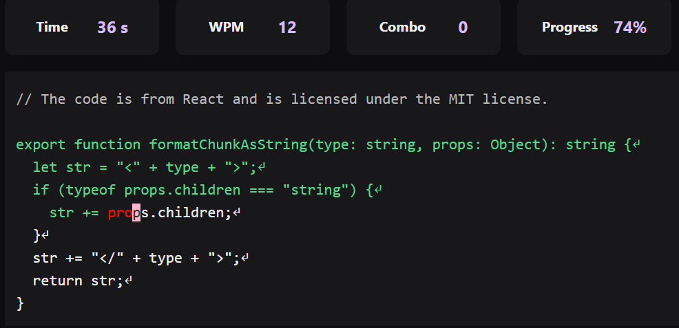
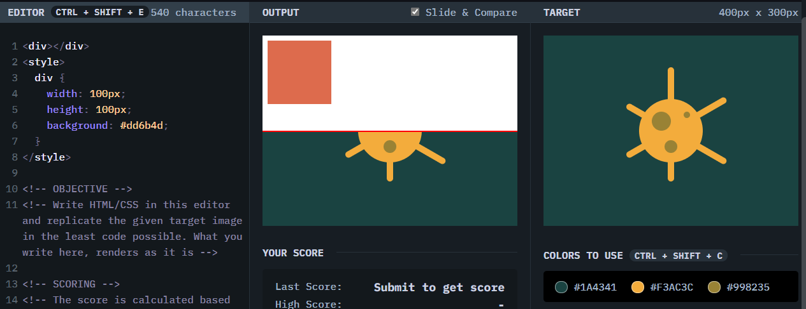
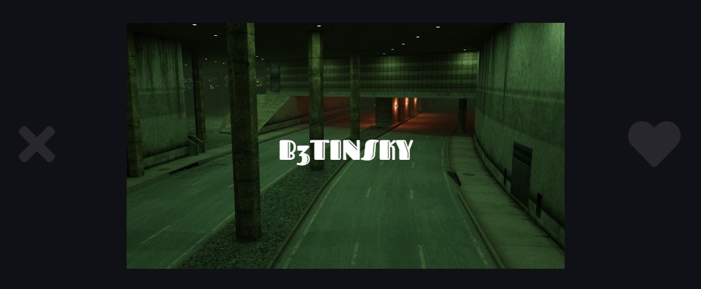

### Speedtyper.dev
Speed typing for developers. Type random snippets of open source code as fast as you can. There is a daily leaderboard based on WordsPerMinute (WPM) and accuracy. Just recently races against other people was developed. If you miss, you can't keep going until you correct your errors. [SpeedTyper.dev](https://www.speedtyper.dev/)

### CSSbattle.dev
A great way to practice CSS skills by recreating a picture with CSS and HTML. You have to get it as close as possible to get more points (or even perfect score) and with the least amount of code. [CSSBattle.dev](https://cssbattle.dev/)

### Fontflipper.com
Deciding on a font can be as hard as deciding what your signature is going to look like, since that font might represent your brand or give an artistic feeling to the whole project. This website allows you to test different fonts on a background of your liking. It determines which fonts you like and which ones you don't with a Tinder style concept (it saves the ones you did like). [FontFlipper.com](https://fontflipper.com/)

