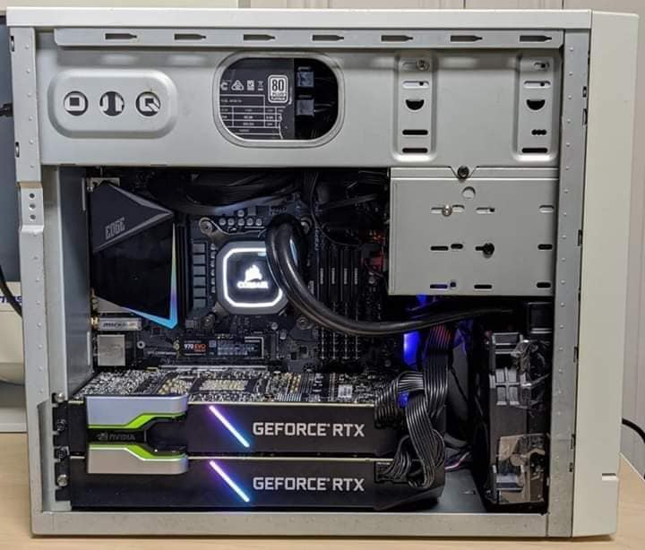

I just launched a new bootcamp!




## Topics Covered

1. Gatsby
2. GraphQL
3. React

```javascript

    console.log(data);
    return (
            <Layout>
            <Head title="Blog" />
            <h1>Blog</h1>
            <ol className={blogStyles.posts}>
                {data.allContentfulBlogPost.edges.map((edge)=>{
                    return (
                        <li className={blogStyles.post}>
                            <Link to={`/blog/${edge.node.slug}`}>
                            <h2>{edge.node.title}</h2>
                            <p>{edge.node.publishedDate}</p>
                            </Link>
                        </li>
                    )
                })}
            </ol>
            </Layout>
    )

```