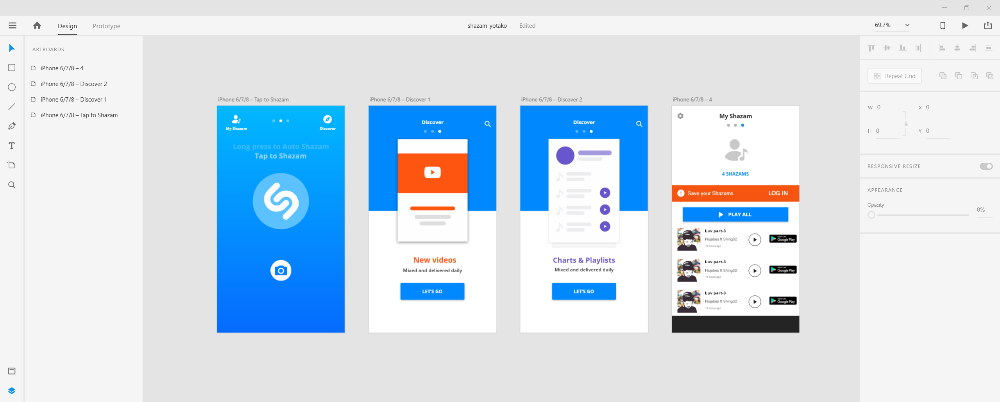

As a web developer the fun part is getting right to action, so when I learned about Adobe XD, I thought "well whats the point?" because I could save time by coding it instead of designing it first. At some point I also perceived it as a tool for UX/UI designers, __*not web developers*__.
After using it a bit (even though I suck at it) I noticed why it should be part of a web developer's workflow.

### So, what is it?

Its a designing and prototyping tool for software in general (at least the visual aspect). You can create a mockup of how the application will look like and even have working prototypes with some actions (like clicking a button takes you to a different page).

### Why use it?
I've used it in teams and for my personal projects, and it saves so much time. First when you want to code, you kinda imagine how your app will end up looking. After roughly having an idea, I usually started coding, but as the app grew bigger sometimes I noticed I should've done things differently or that I missed something. After frustration kicks in because a lot of time was spent modyfing the whole app while trying not to break it (because at some point I forgot to implement an important feature), I just cry and regret that I could've avoided the time lost by just designing the app first.

When working with teams it has a very different use, because I can get confirmation on my ideas from the client, project manager or even from my team.

### Should I learn how to use it tho?
__Yes__. I see it as when an artist does a sketch before starting to paint. In the same way, I think as web developers we should always begin our *masterpieces* with a sketch.

Anyways, its free.