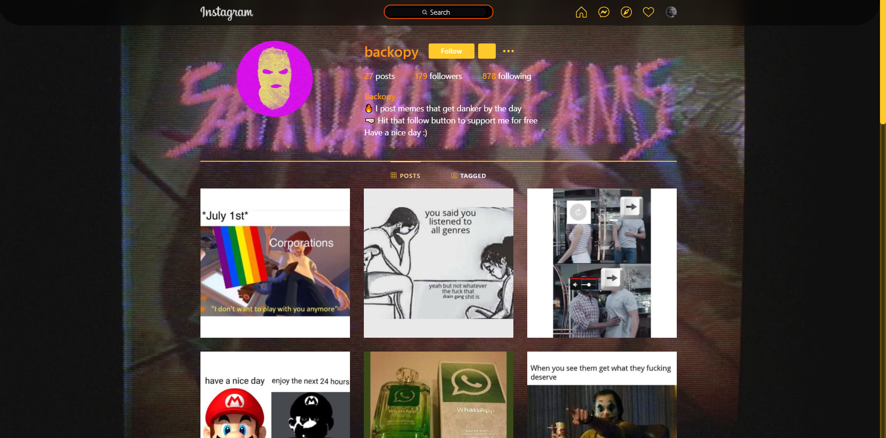

Im always surprised when I come across a meme page on instagram with thousands or even millions of followers, because well... they just post memes. So I wondered, how hard can it be? So I made my own, and I will try to make it as automated (and still geniune) as possible. Maybe in the future I'll use the page's growth to kickstart a youtube channel or another instagram account.

### How it works
Several scripts are used to automate most aspects of the page, and they are combined with the Windows Task Scheduler to make things easier. I am considering moving the scripts to the cloud so they can still work even if Im not using my computer, but its still just an idea.

The scripts I make are based on top of [Ohld's IGBot](https://github.com/ohld/igbot), which connects to Instagram's API. I recommend you check out his bot to understand the API requests better.

### The scripts
- __Backopy Meme Uploader__
Automated meme page. Needs a folder to store memes, with 3 subfolders: CB, BB, WB
  CB: Sets the background to the most common color in the image
  WB: Sets the background to white
  BB: Sets the background to black
It resizes the images in case they are not squared and gives them a background depending on which folder the meme is in.
Must have another python script in the same folder with the name backopyConfig.py with the following:
USERNAME = "user_name"
PASSWORD = "password"

- __getFollower__
Logs in to an instagram account and gets a list of the followers

- __getFollowing__
Logs in to an instagram account and gets a list of the users this account is following

- __unfollowNonFollowers__
Uses previous 2 scripts and starts unfollowing users who are not in both lists (users who you follow but don't follow you back). This script is great for promotion in an instagram account, since you can follow large quantities of users, then only unfollow the ones who didn't follow back, keeping your account's follower ration clean.
This script has a timer and a limit to avoid instagram classifying it as a bot. It waits a random amount of seconds (6 - 15 if unfollow is successful, 30 - 300 if something went south). After it reaches the limit the program stops.

### Next Features
1. Meme Scraper: Download memes from given sources (Twitter, Instagram, Reddit)
2. Resize & Upload Videos
3. Run the scripts from the cloud (AWS)
4. Data collecting (likes, times of day, types of memes, etc.)
5. Group memes and upload as carrousel
6. Resize memes to different ratios (not only 1:1)