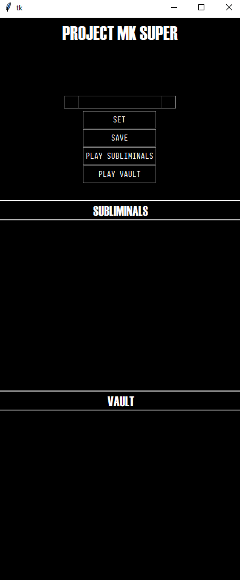

Inspired by the CIA project MK Ultra, I decided to do this project as a solution to me being unable to find motivation study physics. In all my academic history, I've never hated a class (not even math), EXCEPT physics. I find it really hard to focus or even find any interest at all. Even though I hate it, I still needed to pass my exams (meaning I had to study), so I thought the best thing I could do was trick my brain with a good ol' brainwashing. My project is called MK Super because its less than Ultra, since its short spanned flashing messages (not full length propaganda). 

### How it works
You type a list of messages you would like to program in your brain, and a choose a time span for the pause between flashing messages.

- __Input__: The rectangle in the middle serves as an input field where you can type a subliminal message of your choice

- __Intervals__: The squares on each side of the input field, serve as inputs for custom time intervals. The program has a defined interval of 0 to 120 seconds between each flashing subliminal.

- __Set__: A graphical way to set an input into the subliminals box. _The program also handles keyboard shortcuts._

- __Save__: Save your selection of subliminal messages in the vault so you dont have to keep typing them everytime

- __Play Subliminals__: Graphical way of starting your reprogramming session. _Program also handles keyboard shortcuts_.

- __Play Vault__: Plays the subliminals saved in the vault. _Program also handles keyboard shortcuts_.

You can delete a subliminal from the temporary subliminal field, but not from the vault, so choose wisely before saving.

### Next Features
1. Flashing images
2. Turbo-Wash (Rapidly flashing images, videos and text. No pauses)
3. Changing time of subliminal on screen