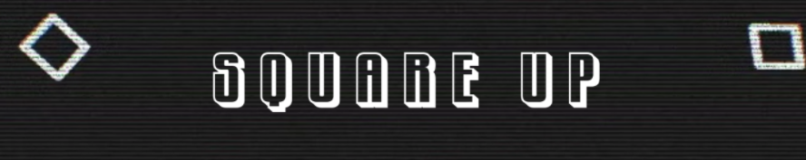
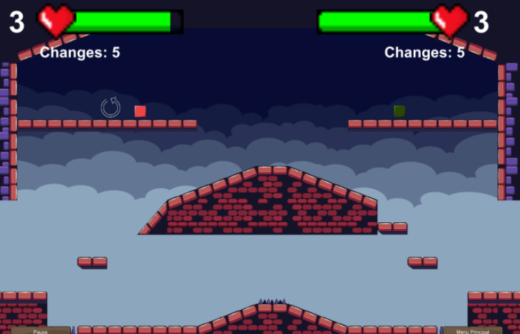
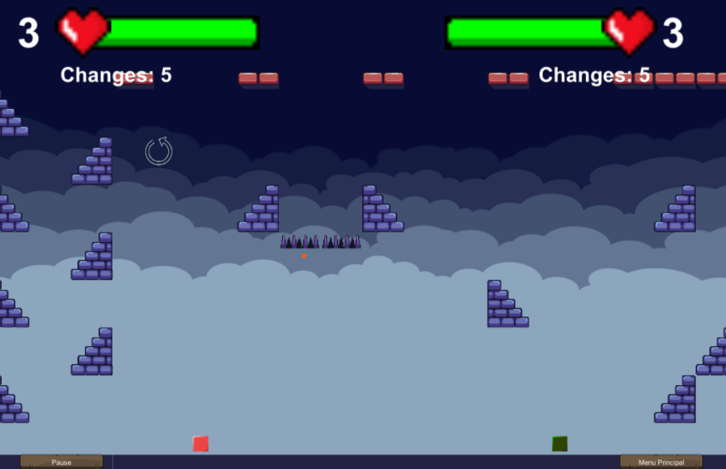

SquareUp is a game I made for the "Videogame development project" class. It was inspired by Super Smash Bros (even though I've never played it) and it has a "rock, paper, scissors" concept. You play as a figure (square, triangle, etc.) and each figure has an advantage (or disadvantage) against other specific figures.

It was an interesting experience because at the beginning I didn't know anything about Unity (nor C#), but even though there was a lot of stress because of other classes I still managed to finish the game in an acceptable state (I still wanted to add more things but there wasn't enough time).

I learned a lot about Unity by making this simple game, since I implemented raycasting, prefabs, particle systems and even pathfinding. Maybe in a future I will add more to this game, but for now it has served its purpose as a great teacher.

[Download the game here](https://b3tinsky.itch.io/squareup) - Password: square